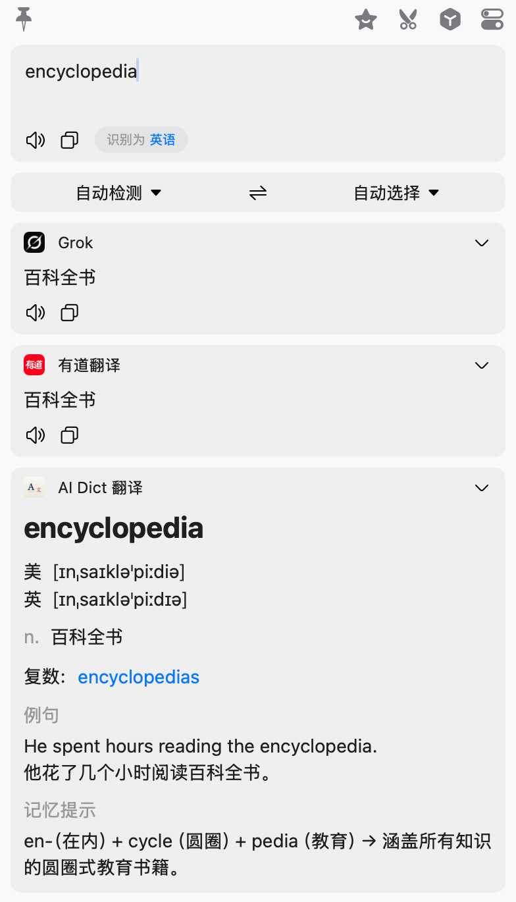
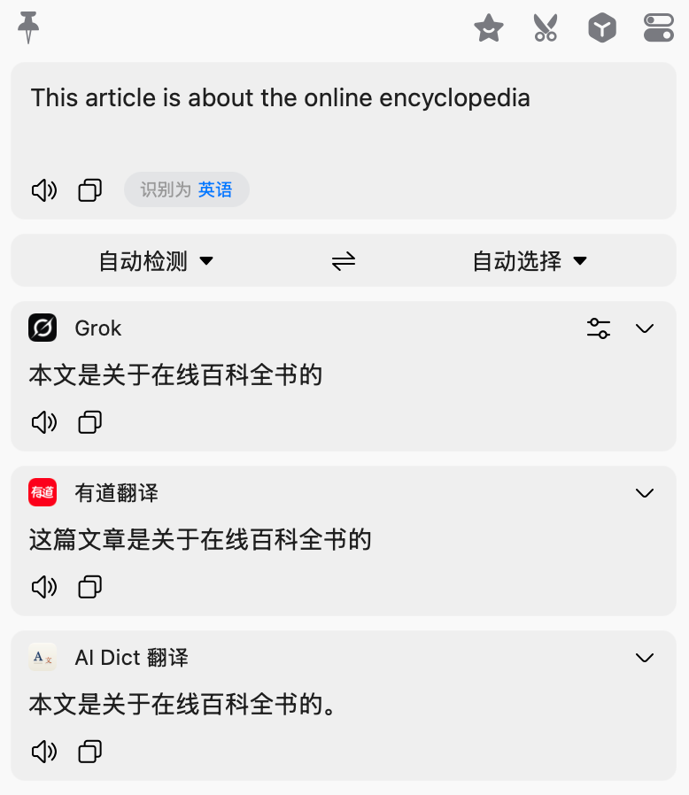

# AI Dict 翻译 — Bob 插件

Bob 翻译插件：**句子正常翻译，单词/短语返回 Bob 原生词典卡片**（音标、词性词义、变形、例句）。

## 效果

| 单词 → 词典卡片 | 句子 → 普通翻译 |
|:---:|:---:|
|  |  |

查单词时展示音标（美/英）、词性词义、变形（可点击跳查）、例句和词根记忆提示；整句输入自动切回普通翻译模式。

## 原理

Bob 的词典 UI 只在服务返回 [`toDict`](https://bobtranslate.com/plugin/object/translateresult.html) 结构时才渲染。本插件：

1. 判断输入是否是单词/短语（≤3 个拉丁词）；
2. 是 → 用词典 Prompt 让 LLM 输出严格 JSON，解析、校验后填入 `toDict`；
3. 否 → 用翻译 Prompt 正常翻译，填入 `toParagraphs`；
4. JSON 解析失败时自动兜底为普通译文，不会报错。

## 安装

到 [Releases](https://github.com/zo-ly/bob-plugin-ai-dict/releases) 下载最新的 `ai-dict-x.x.x.bobplugin`，双击安装进 Bob。之后 Bob 会通过 `appcast.json` 自动检查更新。

然后在 Bob「设置 → 服务」中添加「AI Dict 翻译」，填写配置。

## 配置项

| 选项 | 说明 |
|------|------|
| API 地址 | OpenAI 兼容接口。DeepSeek：`https://api.deepseek.com/chat/completions`；Ollama：`http://localhost:11434/v1/chat/completions` |
| API Key | 密钥；本地模型可留空 |
| 模型 | `gpt-4o-mini` / `deepseek-chat` / `qwen2.5` 等 |
| 词典模式附加要求 | 追加到单词 Prompt 末尾，如"例句偏向计算机领域" |
| 句子翻译 Prompt | 留空用内置；支持 `$sourceLang` `$targetLang` `$text` 变量 |

## 开发

- `info.json` — 插件元信息与用户选项
- `main.js` — `supportLanguages()` + `translate(query, completion)`，无构建步骤

改完代码用 `./scripts/package.sh` 重新打包安装即可（版本号 +1 才会覆盖提示）。

词典 JSON 的结构约束见 `main.js` 里的 `buildToDict()`：`parts` 至少一项才走词典展示；`phonetic.type` 只允许 `us`/`uk`。
