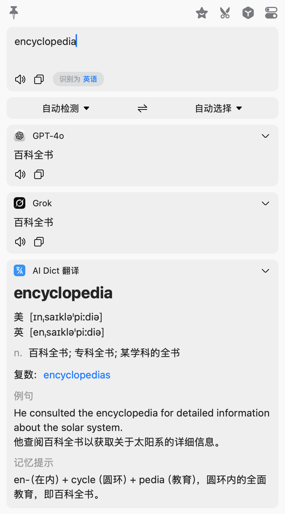
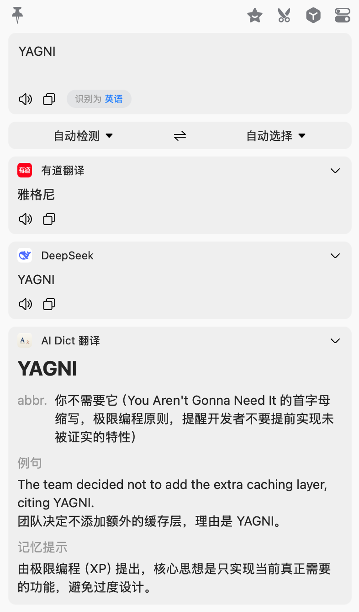
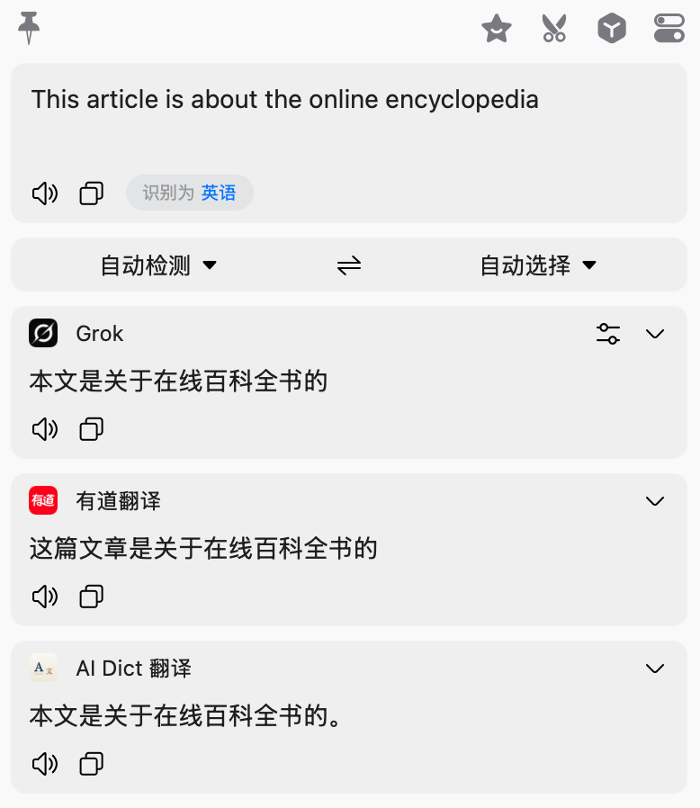

# AI Dict 翻译 — Bob 插件

Bob 翻译插件：**句子正常翻译，单词/短语返回 Bob 原生词典卡片**（音标、词性词义、变形、例句）。

## 效果

| 单词 → 词典卡片 | 缩写/术语 → 词典卡片 | 句子 → 普通翻译 |
|:---:|:---:|:---:|
|  |  |  |

## 原理

Bob 的词典 UI 只在服务返回 [`toDict`](https://bobtranslate.com/plugin/object/translateresult.html) 结构时才渲染。本插件判断输入是单词/短语（≤3 个拉丁词）还是整句：单词让 LLM 输出紧凑的「每行一个字段」文本再解析成 `toDict`，整句走普通翻译填 `toParagraphs`。两条路径都流式输出、边生成边预览；解析失败或老版本 Bob 自动回退为纯文本 / 非流式。

## 安装

到 [Releases](https://github.com/zo-ly/bob-plugin-ai-dict/releases) 下载最新的 `ai-dict-x.x.x.bobplugin`，双击安装进 Bob。之后 Bob 会通过 `appcast.json` 自动检查更新。

然后在 Bob「设置 → 服务」中添加「AI Dict 翻译」，填写配置。

## 配置项

| 选项 | 说明 |
|------|------|
| API 地址 | OpenAI 兼容接口。OpenAI：`https://api.openai.com/v1/chat/completions`；DeepSeek：`https://api.deepseek.com/chat/completions`；Grok：`https://api.x.ai/v1/chat/completions` |
| API Key | 密钥；本地模型可留空 |
| 模型 | `gpt-4o-mini` / `deepseek-chat` / `grok-4-fast-non-reasoning` 等 |
| 词典模式附加要求 | 追加到单词 Prompt 末尾，如"例句偏向计算机领域" |
| 句子翻译 Prompt | 留空用内置；支持 `$sourceLang` `$targetLang` `$text` 变量 |

模型优先选用**非思考模型**：对翻译类任务，开启推理并不能提升质量
（[arXiv:2602.14763](https://arxiv.org/abs/2602.14763)），只会更慢更贵。插件不限制输出长度
（不传 `max_tokens`），思考模型（Qwen3 默认思考模式、deepseek-v4-flash 等）也能出结果，只是需要
等待思考完成；若服务端的默认输出上限被思考过程占满、没有返回正文，插件会给出明确报错。

## 开发

TypeScript 源码在 `src/`，用 esbuild 打包成单个 `dist/main.js`（`dist/` 已 gitignore，发版时由 CI 构建）。

```bash
npm install         # 安装依赖
npm test            # Vitest 单元测试
npm run package     # 类型检查 + 构建 + 打包成 .bobplugin
npm run package:dev # 调试包（版本号自动用时间戳，便于反复安装）
```
